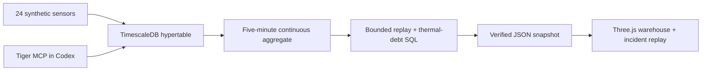

# Frostline

**A warehouse temperature can recover. Its heat exposure doesn't disappear.**

Frostline is a small cold-chain incident replay built with **Tiger Data / TimescaleDB, Three.js and React**. Explore six warehouse zones, follow an excursion from the loading dock into a dispatch buffer, and compare the latest temperature with accumulated _thermal debt_.

The warehouse and sensor data are fictional. The database schema, hypertable, continuous aggregate, SQL export and MCP integration are real. The checked-in replay snapshot makes the app work without a Tiger account or any browser-visible credentials.

## Try it in a minute

Requires Node.js 22.13+ and npm.

```sh
npm ci
npm run dev
```

Open the local URL printed by the server (normally http://localhost:3000).

1. Select **B2 / Dispatch buffer** and inspect its temperature and thermal debt.
2. Click **Dock door opens** and play the incident. The loading dock warms first; the buffer follows.
3. Click **See the aftermath**. Every zone cools down, but the exposure remains visible in the thermal debt view.
4. Select **C1** and scrub to around **08:25 UTC** to see a deliberate telemetry gap. Missing data is visibly unknown and excluded from exposure calculations.
5. Export the selected zone's history as CSV, limited to the current replay position.

Drag the warehouse to orbit, use the zoom buttons, and reset the camera at any time. Every zone also has a keyboard-accessible button. If WebGL is unavailable, the chart, replay, zone controls and metrics remain usable. Playback starts only on request; the 3D scene renders on changes rather than running a permanent animation loop.

## Why thermal debt?

A threshold alert describes a moment. Operators also need to distinguish a brief spike from a sustained warming event, and to see recent exposure after a zone has recovered.

For each **completed, fully observed five-minute bucket**:

```text
thermal debt = Σ max(zone mean temperature − 5 °C, 0) × 5 minutes
```

Ten minutes at 7 °C adds **20 °C·min**. Cooling does not erase that history. Only buckets up to the selected replay time count. Buckets with fewer than four sensor readings remain unknown; the demo does not interpolate or carry readings across gaps. The right panel reports unobserved time.

This is an illustrative operational exposure measure, **not a food-safety model, shelf-life estimate, or validated spoilage prediction**. The 2–5 °C target and color thresholds are demo choices, not universal product limits. Zone means can hide individual sensor peaks. Production systems should use product-specific limits, validated sampling and models, independent sensor identities, calibration and explicit data-quality rules.

## The Tiger Data workflow



- **Hypertable:** `frostline.readings`, partitioned daily, with a `(zone_id, time DESC)` index. The primary key includes time, so seed retries are idempotent.
- **Continuous aggregate:** `frostline.zone_5m` materializes mean temperatures and sensor counts. The refresh policy has a five-minute lag, and the exporter uses an explicit historical window. `materialized_only=true` makes the snapshot boundary unambiguous.
- **Hypercore:** a columnstore policy moves chunks older than seven days, segmented by zone and sensor. This demonstrates the storage lifecycle; the tiny demo is not a compression benchmark.
- **Missingness:** a timestamp grid crossed with zones and left-joined to the rollup keeps missing buckets visible.
- **Verification:** export uses a repeatable-read transaction and checks all six SQL thermal-debt totals against the TypeScript implementation before writing the snapshot.
- **Credentials:** direct PostgreSQL scripts require TLS certificate verification; MCP scripts use Tiger CLI's connection defaults. The website only receives synthetic aggregate data. Tiger CLI keeps account credentials and service passwords in the OS credential store; optional `.env.database` stays ignored.
- **Tiger MCP:** the alternate seed/export path calls Tiger's real `db_execute_query` tool over stdio. Its JSON export is assembled in one SQL statement, checked for truncation, and verified against the client calculation.

The snapshot is intentional: this project explores a historical incident, without adding an always-on ingestion service, API or secret-management burden. Run `npm run data:sync` and rebuild to publish a fresh snapshot. It is not live polling.

### Connect your own Tiger database

Install the CLI using [Tiger's official installation instructions](https://www.tigerdata.com/docs/get-started/quickstart/tiger-cli). On Windows PowerShell:

```powershell
irm https://cli.tigerdata.com/install.ps1 | iex
tiger auth login
tiger mcp install codex
```

Restart Codex to load the new `tiger` MCP server. `tiger mcp install codex` merges into the existing user configuration and uses the installed binary's absolute path.

Use an isolated DEV service. The following explicitly requests free shared resources in the supported region:

```sh
tiger service create --name frostline-demo --cpu shared --memory shared --region us-east-1 --environment DEV
npm run db:seed
npm run data:sync
```

The scripts use the CLI's default service. Set `TIGER_SERVICE_ID` in `.env.database` to select a different service, or set `DATABASE_URL` to a PostgreSQL connection string. See `.env.example`. Never commit `.env.database`. If Tiger reports an expired OAuth token, rerun `tiger auth login`; a locally stored database connection can be used independently of CLI OAuth.

To seed and export **through Tiger MCP itself**, set `TIGER_SERVICE_ID` in `.env.database`, authenticate the CLI, and run:

```sh
npm run db:seed:mcp
npm run data:sync:mcp
```

These use Tiger CLI's saved password and connection defaults. On newly provisioned services, Tiger may initially present a bootstrap certificate before installing its publicly signed certificate. The direct PostgreSQL scripts deliberately require certificate verification and may need to wait for that provisioning step; the MCP path uses Tiger's standard encrypted connection. See [Tiger's SSL documentation](https://docs.timescale.com/use-timescale/latest/security/strict-ssl/).

The seed creates only the `frostline` schema and project resources; it does not drop existing tables. Run it twice to verify idempotency. It inserts **6,892** synthetic readings for 4 September 2026, with a 25-minute outage in C1, then refreshes the historical aggregate explicitly. The raw readings average into 1,728 time/zone slots, including five empty slots. Data is fixed and reproducible.

Without a database, generate the same offline dataset:

```sh
npm run data:fixture
```

The UI labels a local fixture differently from a snapshot exported from Tiger.

### Useful MCP prompts

- “Show me the schema and indexes for the frostline.readings hypertable.”
- “Which zones had the highest degree-minutes above 5 °C on 4 September 2026? Exclude incomplete five-minute buckets.”
- “Check the continuous aggregate refresh policy and the Hypercore columnstore policy for this demo.”
- “Explain this replay query and how it preserves missing telemetry.”

```sh
npm run mcp:check
```

This initializes the actual stdio MCP server and verifies that `db_execute_query` and `service_list` are registered. No account secrets are printed. See [Tiger MCP documentation](https://www.tigerdata.com/docs/get-started/quickstart/mcp-cli).

## Project map

| Path                               | Purpose                                                        |
| ---------------------------------- | -------------------------------------------------------------- |
| `app/page.tsx`                     | Shared replay state, controls, zone details, CSV export        |
| `components/warehouse.tsx`         | Orthographic Three.js scene, picking, orbit controls, disposal |
| `components/temperature-chart.tsx` | SVG temperature history with explicit gaps                     |
| `lib/telemetry.ts`                 | Deterministic fixture and tested exposure calculation          |
| `db/001_schema.sql`                | Hypertable, continuous aggregate and Hypercore policy          |
| `db/replay.sql`                    | Bounded time grid with missing-bucket preservation             |
| `db/thermal-debt.sql`              | Independent SQL exposure calculation                           |
| `scripts/seed.ts`                  | Idempotent synthetic ingestion and historical refresh          |
| `scripts/export.ts`                | SQL export and parity verification                             |
| `data/telemetry.json`              | Portable, nonsecret replay dataset                             |

## Development and checks

```sh
npm test
npm run typecheck
npm run lint
npm run build
npm start
```

Tests cover exposure magnitude/duration, exact thresholds, missing/partial buckets, recovered temperatures, replay cutoffs and deterministic incidents. `npm start` runs the built Worker locally through Wrangler.

The frontend uses the Sites Vinext/React starter and can deploy as a Cloudflare Worker. `.openai/hosting.json` is this demo's Sites project binding; create your own Site and replace its project ID when deploying a fork. No database credentials are needed by the deployment.

Optional browser WebMCP exposes `inspect_frostline` and `set_frostline_replay` when `document.modelContext` is supported. These operate on the same visible page state and do not execute database writes. Browsers without the proposal are unaffected.

## Scope and validation limits

This is a focused portfolio experiment: a fixed snapshot, one facility, six zones and one incident. The sensor-count check is appropriate to the seeded one-reading-per-sensor-per-bucket dataset; real ingestion must count distinct sensor identities and reject duplicates. Historical refreshes and raw-data retention must be coordinated before adding retention jobs. No claim is made about production-scale query performance, GPU benchmarks, or browser/device QA.

Built by [SeloSlav](https://github.com/SeloSlav). Independent demo; not affiliated with Tiger Data.
