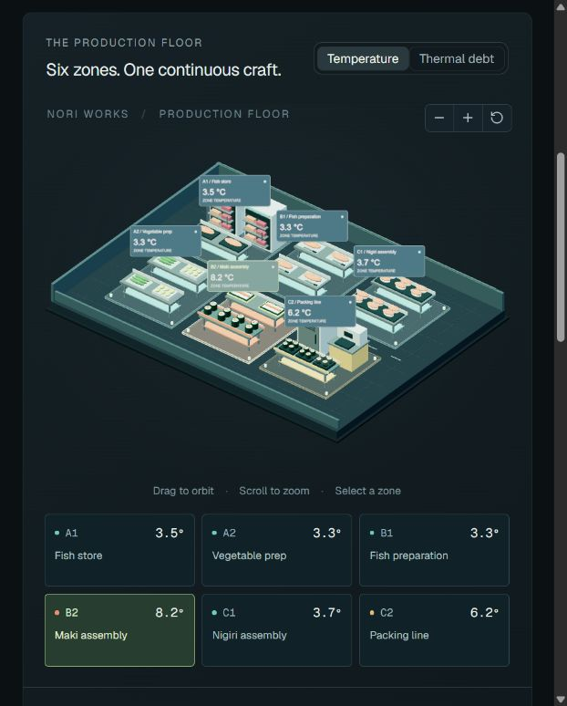
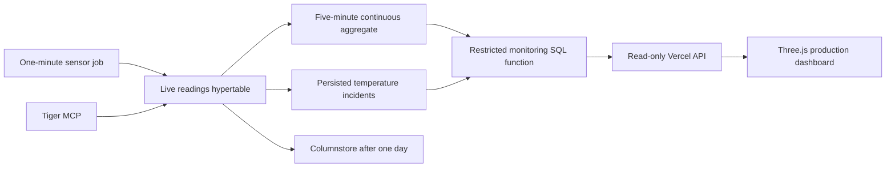

# Frostline



[**Open Frostline**](https://seloslav.github.io/tiger-cloud-project/) · [Live monitoring architecture](docs/live-monitoring.md) · [Database support walkthrough](docs/support-runbook.md) · [Build checks](https://github.com/SeloSlav/tiger-cloud-project/actions)

**Temperature monitoring for sushi production.**

Frostline monitors **Nori Works**, a fictional sushi manufacturing facility in Zagreb. Built with **Tiger Data / TimescaleDB, Three.js and React**, it brings refrigerated fish storage, ingredient preparation, maki and nigiri assembly, and chilled packing into one production floor. Operators can check current temperatures, inspect sustained warming incidents and compare the last 24 hours of exposure.

The sensor inputs are simulated; the monitoring runs continuously. A Timescale background job writes a new observation from each sensor every minute and persists incident state. A read-only API on Vercel queries Tiger while the dashboard refreshes every 30 seconds. Collection continues when the page and the developer's computer are closed. The original recorded shift remains available under **Shift archive**.

| Zone | Production stage | Equipment and product                            |
| ---- | ---------------- | ------------------------------------------------ |
| A1   | Fish store       | Refrigerated cabinets, salmon and tuna trays     |
| A2   | Vegetable prep   | Stainless benches, cucumber and avocado          |
| B1   | Fish preparation | Cutting boards and portioned salmon              |
| B2   | Maki assembly    | Rolling mats and hand-carried maki trays         |
| C1   | Nigiri assembly  | Trays of salmon nigiri                           |
| C2   | Packing line     | Sushi trays, a tray sealer and a packing chiller |

## Try it in a minute

Requires Node.js 22.13+ and npm.

```sh
npm ci
npm run dev
```

Open the local URL printed by the server (normally http://localhost:3000).

1. Open **Live monitoring**, select a zone and inspect its current temperature. The feed shows the latest sensor timestamp, independently of the page request time.
2. Select an **Open** or **Recovered** incident to focus its production area. Check its start, peak temperature and recovery time.
3. Inspect the rolling history. Missing or partial readings appear as gaps; a stalled feed becomes visibly delayed.

For the original guided incident replay, choose **Shift archive**:

1. Select **B2 / Maki assembly** and inspect its temperature and thermal debt.
2. Click **Packing chiller pauses** and play the incident. Packing warms first; the maki line follows.
3. Click **Shift totals**. Every zone cools down, with the exposure recorded in the thermal debt view.
4. Select **C1** and scrub to around **08:25 UTC** to see a deliberate telemetry gap. Missing data is visibly unknown and excluded from exposure calculations.
5. Export the selected zone's history as CSV, limited to the current replay position.

Selecting equipment or a zone button smoothly brings that area into close view. The other floating labels and floor outlines disappear; **Whole factory** restores the overview. Orbit and zoom remain available in either view.

Fourteen articulated workers handle twelve reusable trays across overlapping batches. Receiving, fish preparation, maki and nigiri assembly, vegetable supply, packing, chilling and dispatch run concurrently. Directional walking lanes and staggered crew schedules keep the aisles moving without a factory-wide lock. Workers pick up real trays, carry them with their gloves on the handles, place them on stationary benches and return for the next batch. Ingredients and lids are separate objects placed during assembly and packing; finished stock leaves through dispatch before its pooled tray is reused off the production floor.

The factory is a continuous demonstration that opens with work already in progress. Its brisk 1.65× clock is independent of Live/Archive selection, temperature updates and incident replay. The activity button pauses only the demonstration; **Restart production sequence** returns to the same busy opening. Reduced-motion preferences start it paused. Animation runs at a capped render rate and suspends while the scene is offscreen or the tab is hidden.

Each zone has a keyboard-accessible selection button. If WebGL is unavailable, the chart, replay, zone controls and metrics remain usable.

## Why thermal debt?

A threshold alert describes a moment. Operators also need to distinguish a brief spike from a sustained warming event, and to see recent exposure after a zone has recovered.

For each **completed, fully observed five-minute bucket**:

```text
thermal debt = Σ max(zone mean temperature − 5 °C, 0) × 5 minutes
```

Ten minutes at 7 °C adds **20 °C·min**. Cooling does not erase that history. Live monitoring integrates the last 24 hours; the archive counts only buckets up to the selected replay time. Live buckets require all **20 samples from four registered sensors** (one per minute). The older archive has four samples per bucket. Incomplete buckets remain unknown; neither path interpolates across gaps. The right panel reports unobserved time.

The replay uses a 2–5 °C target for its six chilled stages. Thermal debt is an area-under-the-curve calculation over zone averages; the database also retains peak sensor temperatures in the rollup.

## The Tiger Data workflow



The running workflow uses the separate `frostline_live` schema: a sensor registry, timestamp-aligned observations, a real-time continuous aggregate, incident persistence, custom background job, Hypercore columnstore and coordinated retention policies. The API's database role can execute one bounded function and cannot select or insert raw table rows. [Setup, tests, measured storage savings and stopping the collector](docs/live-monitoring.md).

The original `frostline` schema powers the fixed shift archive:

- **Hypertable:** `frostline.readings`, partitioned daily, with a `(zone_id, time DESC)` index. The primary key includes time, so seed retries are idempotent.
- **Continuous aggregate:** `frostline.zone_5m` materializes mean temperatures and sensor counts. The refresh policy has a five-minute lag, and the exporter uses an explicit historical window. `materialized_only=true` makes the snapshot boundary unambiguous.
- **Hypercore:** a columnstore policy moves chunks older than seven days, segmented by zone and sensor. This demonstrates the storage lifecycle; the tiny demo is not a compression benchmark.
- **Missingness:** a timestamp grid crossed with zones and left-joined to the rollup keeps missing buckets visible.
- **Data quality:** before publishing, both exporters check the bounded raw readings for repeated sensor samples and unexpected identities. A bucket's four rows must come from the four known sensors. Invalid input aborts the export; missing readings remain visible gaps.
- **Verification:** export uses a repeatable-read transaction and checks all six SQL thermal-debt totals against the TypeScript implementation before writing the snapshot.
- **Credentials:** direct PostgreSQL scripts require TLS certificate verification; MCP scripts use Tiger CLI's connection defaults. The website only receives synthetic aggregate data. Tiger CLI keeps account credentials and service passwords in the OS credential store; optional `.env.database` stays ignored.
- **Tiger MCP:** the alternate seed/export path calls Tiger's real `db_execute_query` tool over stdio. Its JSON export is assembled in one SQL statement, checked for truncation, and verified against the client calculation.

The archive remains a portable snapshot: run `npm run data:sync` and rebuild to replace it. Live monitoring queries the separate API and does not need a website deployment to show new readings.

### Connect your own Tiger database

Install the CLI using [Tiger's official installation instructions](https://www.tigerdata.com/docs/get-started/quickstart/tiger-cli). On Windows PowerShell:

```powershell
irm https://cli.tigerdata.com/install.ps1 | iex
tiger auth login
tiger mcp install codex
```

Restart Codex to load the new `tiger` MCP server. `tiger mcp install codex` merges into the existing user configuration and uses the installed binary's absolute path.

Use an isolated DEV service. The following explicitly requests free shared resources in the supported region:

```sh
tiger service create --name frostline-demo --cpu shared --memory shared --region us-east-1 --environment DEV
npm run db:seed
npm run data:sync
```

The scripts use the CLI's default service. Set `TIGER_SERVICE_ID` in `.env.database` to select a different service, or set `DATABASE_URL` to a PostgreSQL connection string. See `.env.example`. Never commit `.env.database`. If Tiger reports an expired OAuth token, rerun `tiger auth login`; a locally stored database connection can be used independently of CLI OAuth.

To seed and export **through Tiger MCP itself**, set `TIGER_SERVICE_ID` in `.env.database`, authenticate the CLI, and run:

```sh
npm run db:seed:mcp
npm run data:sync:mcp
```

These use Tiger CLI's saved password and connection defaults. On newly provisioned services, Tiger may initially present a bootstrap certificate before installing its publicly signed certificate. The direct PostgreSQL scripts deliberately require certificate verification and may need to wait for that provisioning step; the MCP path uses Tiger's standard encrypted connection. See [Tiger's SSL documentation](https://docs.timescale.com/use-timescale/latest/security/strict-ssl/).

Tiger's **free services do not receive publicly signed SSL certificates**. For the live API on this free DEV service, `FROSTLINE_TLS_MODE=require` explicitly selects an encrypted connection without CA verification, matching the CLI's default. Other deployments default to `verify-full`. The API never silently weakens TLS after a connection error. See [live deployment details](docs/live-monitoring.md).

The seed creates the `frostline` schema and project resources. Repeated runs update zone names and product descriptions while preserving existing readings. It inserts **6,892** synthetic readings for 4 September 2026, with a 25-minute outage in C1, then refreshes the historical aggregate explicitly. The raw readings average into 1,728 time/zone slots, including five empty slots. Data is fixed and reproducible.

Without a database, generate the same offline dataset:

```sh
npm run data:fixture
```

The UI labels a local fixture differently from a snapshot exported from Tiger.

### Verify and troubleshoot the database

```sh
npm run db:verify:mcp
```

This runs read-only checks against the actual Tiger service: raw-to-rollup parity, sensor identity and duplicate checks, a SQL regression using CTE fixtures, job status, chunk storage state, and a bounded `EXPLAIN (ANALYZE, BUFFERS)`. It does not seed or modify tables. See the [support walkthrough](docs/support-runbook.md) for the measured result and how to investigate connection, refresh and query-plan issues.

### Useful MCP prompts

- “Show me the schema and indexes for the frostline.readings hypertable.”
- “Which zones had the highest degree-minutes above 5 °C on 4 September 2026? Exclude incomplete five-minute buckets.”
- “Check the continuous aggregate refresh policy and the Hypercore columnstore policy for this demo.”
- “Explain this replay query and how it preserves missing telemetry.”

```sh
npm run mcp:check
```

This initializes the actual stdio MCP server and verifies that `db_execute_query` and `service_list` are registered. No account secrets are printed. See [Tiger MCP documentation](https://www.tigerdata.com/docs/get-started/quickstart/mcp-cli).

## Project map

| Path                               | Purpose                                                        |
| ---------------------------------- | -------------------------------------------------------------- |
| `app/page.tsx`                     | Shared replay state, controls, zone details, CSV export        |
| `components/warehouse.tsx`         | Orthographic Three.js scene, picking, orbit controls, disposal |
| `lib/facility-scene.ts`            | Shared geometry kit for prep benches, equipment and sushi      |
| `lib/facility-camera.ts`           | Responsive zone framing and camera transition parameters       |
| `lib/factory-activity.ts`          | Articulated workers, tray cargo and procedural work poses      |
| `lib/factory-motion.ts`            | Dependency-ordered production plan and object ownership        |
| `components/temperature-chart.tsx` | SVG temperature history with explicit gaps                     |
| `lib/telemetry.ts`                 | Deterministic fixture and tested exposure calculation          |
| `db/001_schema.sql`                | Hypertable, continuous aggregate and Hypercore policy          |
| `db/replay.sql`                    | Bounded time grid with missing-bucket preservation             |
| `db/thermal-debt.sql`              | Independent SQL exposure calculation                           |
| `db/quality.sql`                   | Reject repeated sensor samples and unexpected identities       |
| `db/diagnostics.sql`               | Compare raw data and rollups; inspect jobs and chunks          |
| `scripts/verify-mcp.ts`            | Read-only Tiger diagnostics, SQL regression and query plan     |
| `scripts/seed.ts`                  | Idempotent synthetic ingestion and historical refresh          |
| `scripts/export.ts`                | SQL export and parity verification                             |
| `data/telemetry.json`              | Portable, nonsecret replay dataset                             |

## Development and checks

```sh
npm test
npm run typecheck
npm run lint
npm run build
npm start
```

Tests cover exposure magnitude/duration, exact thresholds, missing/partial buckets, recovered temperatures, replay cutoffs and deterministic incidents. `npm start` runs the built Worker locally through Wrangler.

Scene checks cover camera framing, batch dependencies, exclusive tray ownership, continuous handoffs and loop boundaries, worker and equipment clearance, glove contact, activity density and the pooled geometry budget. The floor averages more than five visible walkers and at least 2.5 loaded trays in transit. `?scene-debug=1` displays walking routes; add `&scene-time=90` to inspect a reproducible paused moment. Motion is deterministic in elapsed seconds and independent of temperature replay. There is no post-processing pass; the regular rendering is also the no-post baseline.

The frontend uses the Sites Vinext/React starter and can deploy as a Cloudflare Worker. `.openai/hosting.json` is this demo's Sites project binding; create your own Site and replace its project ID when deploying a fork. No database credentials are needed by the deployment.

### GitHub Pages

The [public demo](https://seloslav.github.io/tiger-cloud-project/) uses the same app and checked-in Tiger snapshot, exported to static HTML with hydrated React and Three.js:

```sh
npm run build:pages
```

The build checks local asset references and packages `out/` for the `/tiger-cloud-project/` URL prefix. `.github/workflows/pages.yml` tests and deploys every push to `main` through GitHub Actions. No Tiger password or database service is required by Pages. The replay is a historical archive; the animated workers are procedural scene activity.

For a fork with a different repository name, update the prefix in `next.config.ts`, `app/layout.tsx` and `scripts/package-pages.mjs`, then enable **Settings → Pages → GitHub Actions**. The default `npm run build` continues to target the Worker. A build-only Windows preload yields before Vinext exits to avoid [Node's fetch teardown issue](https://github.com/nodejs/node/issues/56645); it preserves the exit status and is not shipped to browsers.

Optional browser WebMCP exposes `inspect_frostline` and `set_frostline_replay` when `document.modelContext` is supported. These operate on the same visible page state and do not execute database writes. Browsers without the proposal are unaffected.

## Scope and validation limits

This is a focused portfolio experiment: a fixed snapshot, one facility, six zones and one incident. The exporter enforces the seeded one-reading-per-known-sensor-per-bucket contract. A real ingestion pipeline would need an equipment registry, changing sensor membership, event-time deduplication and an explicit policy for irregular sampling and late arrivals. Historical refreshes and raw-data retention must be coordinated before adding retention jobs. The support walkthrough includes one small query-plan measurement; it is not evidence of production-scale performance. No GPU benchmark or broad browser/device QA is claimed.

Built by [SeloSlav](https://github.com/SeloSlav). [MIT licensed](LICENSE). Independent demo; not affiliated with Tiger Data.
